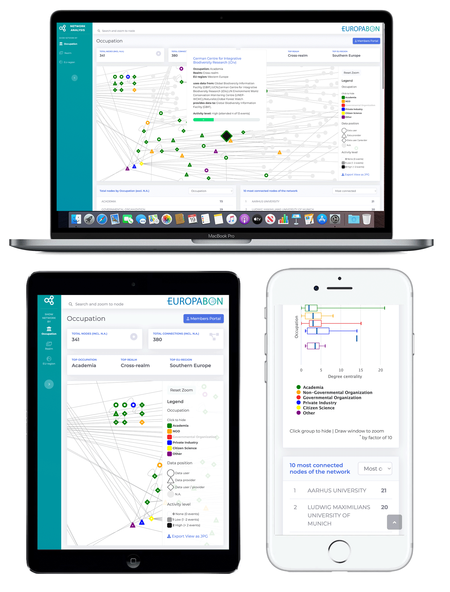

## EuropaBON Network Analysis

Fully responsive web app to visualize the network of EuropaBON by using [Cytoscape JS](https://js.cytoscape.org/)

## Demo

The EuropaBON stakeholder network visualizer can be accessed via: [https://europabon.org/members/network-analysis/src](https://europabon.org/members/network-analysis/src)

## Centrality

### Degree centrality
The degree centrality of a node is its degree — the number of edges it has. The higher the degree, the more connected the node is.

`cy.$().dc({ root: #${id}}).degree;`

### Eigenvector centrality
Cytoscape rank the nodes in the collection using the [Page Rank algorithm](https://en.wikipedia.org/wiki/PageRank). PageRank works by counting the number and quality of links to a node to determine a rough estimate of how important the node is. The underlying assumption is that more important nodes are likely to receive more links from other nodes.

`cy.elements().pageRank().rank(#${id});`

## Source Data

Data is automatically provided by the [EuropaBON members portal](https://europabon.org/members) from a REST API.

## Built With

* [Bootstrap 4](http://getbootstrap.com) - HTML, CSS, JS web framework
* [Cytoscape JS](https://js.cytoscape.org) - Platform for visualizing networks
* [HighCharts](https://www.highcharts.com) - Charts for web and mobile platforms
* [Typeahead.js](https://twitter.github.io/typeahead.js) - Twitter Typeahead
* [Datatables JS](https://datatables.net) - Datatables JS

